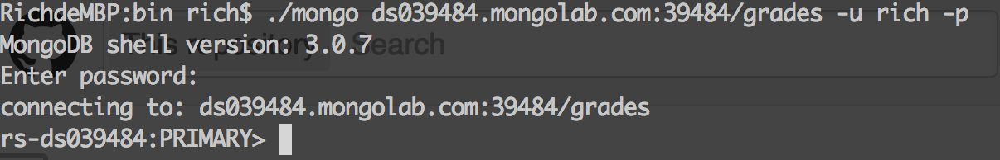

## Thinkpower-MongoDB-Workshop
=======================

######MongoDB related website:######
* [MongoDB](http://www.mongodb.org/)
* [MongoLab](https://mongolab.com/)
* [Robomongo](http://robomongo.org/) 

---------------

######Cloud MongoDB connection information:######
- My mongoDB URI: ds039484.mongolab.com:39484
- Account: rich
- Password: 1111

How to connect MongoLab
### In your ${mongo-home}/bin
* Execute mongo command:

        mongo ds039484.mongolab.com:39484/grades -u rich -p
  Then input password then you can see the success login message as follow:
  [](login-success.png)

* Import data into your mongoDB:

        mongoimport -h ds039484.mongolab.com:39484 -d grades -c grade -u USERNAME -p PASSWORD --file {your file path}/grades.json
        
######CRUD command:######
* Query:

  ```javascript
        db.grade.find()
        db.grade.find({"student_id" : 1}).pretty()
        db.grade.find({"student_id" : 1}, {"_id":0, "student_id":1, "class_id":1}).pretty()
  ```
* Insert:

  ```javascript
       var student_100 = {
	           "student_id" : 100,
	           "class_id" : 200,
	           "scores" : [ {
			                      "type" : "exam",
			                      "score" : 100
		                      },
		                      {
			                      "type" : "quiz",
			                      "score" : 99.99
		                      } ]
       }
      db.grade.insert(student_100)
  ```      
* Update:

  ```javascript
     db.grade.update({"student_id" : 100}, {"class_id" : 200})   // Note - Document Replacement

     //Update field must use - $set modifiers
     db.grade.update(
         {"student_id" : 100},
         { $set: { "class_id" : 300 }
         })

     //Incremental Modifiers - $inc
     db.grade.update( 
         {"student_id" : 100},
				 {"$inc" : {"class_id" : 100}} )
  ``` 
  
* Push element to Array:

  ```javascript
     db.grade.update(
         {"student_id" : 100},
         {"$push" : {"scores" :
                          {"type" : "test", "score" : 99.0401025053437}
                    }
         } )
  ```
  
* Remove:

  ```javascript
     db.grade.remove({"student_id" : 100})
  ```
  
######Run javascript to access MongoDB:######
      mongo {file path}/query.js
        
      mongo {file path}/queryDBStatus.js

######Run Blog project:######

      mvn compile exec:java -Dexec.mainClass=com.rich.tutorial.blog.BlogApp
        
  Or you can agssign your mongoDB uri and DB name
  
      mvn compile exec:java -Dexec.mainClass=com.rich.tutorial.blog.BlogApp -Dexec.args="mongodb://localhost:27017 blog2"

